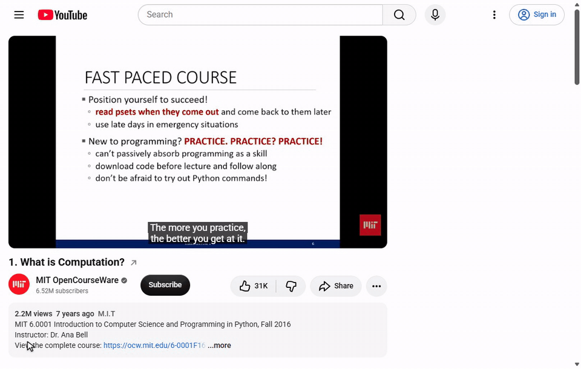
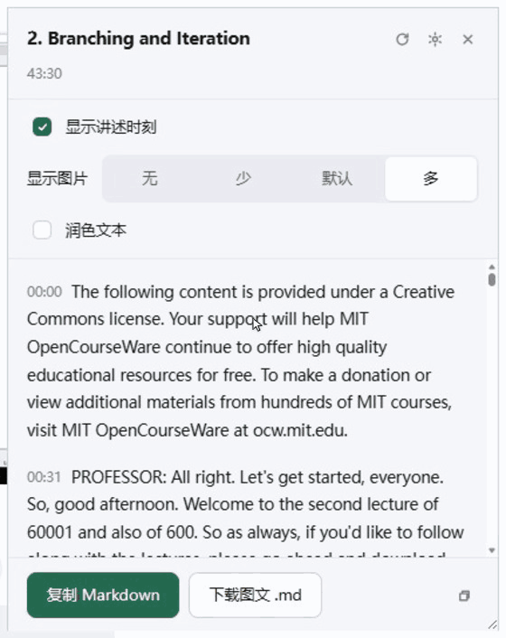
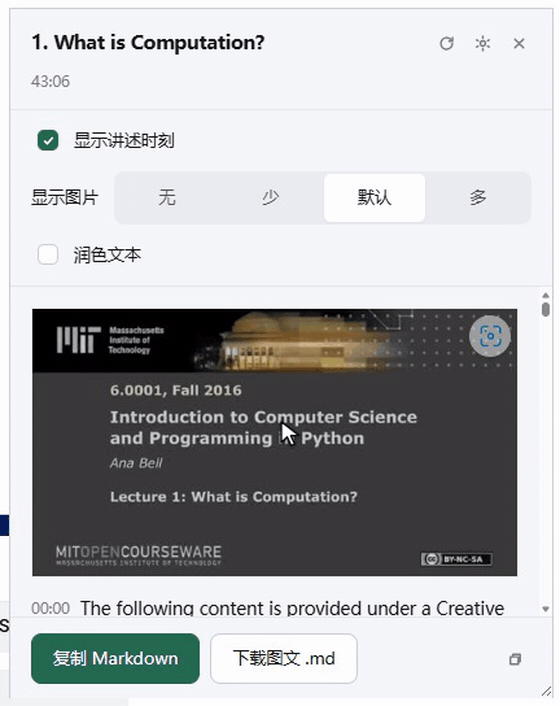
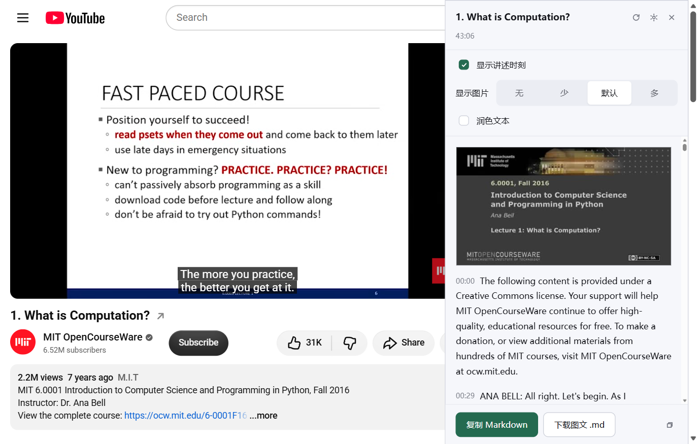

<div align="center">

<picture>
  <source media="(prefers-color-scheme: dark)" srcset="docs/media/banner-dark.svg">
  
</picture>

[简体中文](README.md) · [正體中文](README.zh-Hant.md) · [English](README.en.md) · **日本語**

[](https://github.com/Tchirek/course2md-web/actions/workflows/ci.yml)
[](https://github.com/Tchirek/course2md-web/releases/latest)
[](LICENSE)


[](https://github.com/Tchirek/course2md-web/commits/legacy/standalone-helper)

</div>

Web には Standalone 版と CLI 版があり、[リリースページ](https://github.com/Tchirek/course2md-web/releases/latest)で選べます。このブランチは Standalone 版のヘルパーとローカル処理を開発し、CLI 版のソースは [main](https://github.com/Tchirek/course2md-web/tree/main) にあります。

# course2md — ブラウザ拡張版

動画のページを、**画面・タイムスタンプ・ジャンプ・任意の校正つき**の講義ノートに変えます。図入りダウンロードには `course.md` と `frames/` のスクリーンショットが入ります。

<p align="center">
  
  <br>
  <sub>タイトル末尾の ↗ を押すだけ：数秒で文字が出て、画像があとから埋まります（画像待ちの部分は早送り）</sub>
</p>

> **注：** 拡張の画面表示は現在、簡体字中国語のみです。この README では画面上の表記を中国語のまま引用し、訳を添えています（例：「生成笔记」（ノートを生成））。

これは [mizorewww/course2md](https://github.com/mizorewww/course2md) のブラウザ版で、
「動画 → 図入りノート」をブラウザの中で完結させます。プラットフォームの字幕と、ブラウザが直接読める普通の動画には外部ツールは要りません。
YouTube・Bilibili の音声を素早く取り出すときは、任意で `yt-dlp` と `ffmpeg` を使えます。文字の出どころは**プラットフォームの字幕**でも、**自分で動かすローカルモデルの文字起こし**でも構いません。

画面と設計上の取捨は [yetone/kill-ai-slop](https://github.com/yetone/kill-ai-slop) に従っています。

---

## できること

YouTube か Bilibili で動画を開き、拡張のアイコンを押して画像の密度を選び、「生成笔记」（ノートを生成）を押します。ポップアップはすぐ閉じ、浮遊パネルに進み具合が出ます。文字起こしが終わるとまず文字、続いて画像が表示されます。パネルは見出しをドラッグして移動、右下の角で大きさを変えられ、画面の右端まで運ぶと全高のサイドバーに吸着します。

もっと手早い入口：動画タイトルの末尾に ↗ があり、押せばすぐ生成が始まります。その回はプラットフォームの字幕を優先し（無ければ自動でローカルの文字起こしに切り替え）、画像の密度は前回選んだ段階を使います。この方法で始めた自動生成は、動画を切り替えても同じようにします。

- 浮遊パネルは、画面ごとのまとまりで動画のスクリーンショットと話した内容を並べます。
- タイムスタンプを押すと、動画のその位置へ飛びます。
- 「复制 Markdown」（Markdown をコピー）は文字版をコピーします。図入りダウンロードは `course.md` と `frames/slide_*.jpg` を同じフォルダに保存します。
- 生成中でもコピーとダウンロードを押せます。ボタンが破線枠の「完成后复制」「完成后下载」（完了後にコピー／ダウンロード）に変わり、画像と校正を含めてすべて終わった瞬間に自動で実行されます。もう一度押すと取り消し。
- 拡張のコードがディスク上で更新されたのに再読み込みしていない場合、ページから始めた生成は、まず拡張を再読み込みしてページを更新し、それから生成を続けます。

<table>
  <tr>
    <th width="50%">生成中にコピー・ダウンロード：終わった瞬間に実行</th>
    <th width="50%">画像の密度はいつでも切り替え：なし／少／標準／多</th>
  </tr>
  <tr>
    <td align="center"></td>
    <td align="center"></td>
  </tr>
</table>

### 出来上がるノート

図入りダウンロードは一つのフォルダになります：

```text
<動画のタイトル>/
├── course.md
└── frames/
    ├── slide_0001.jpg
    ├── slide_0002.jpg
    └── …
```

`course.md` の冒頭（実際の出力の抜粋。長い段落は途中で省略）。見出し情報の項目名は中国語で書かれます：

```markdown
# 2. Branching and Iteration

- 作者：MIT OpenCourseWare
- 时长：43:30
- 来源：[https://www.youtube.com/watch?v=0jljZRnHwOI](https://www.youtube.com/watch?v=0jljZRnHwOI)
- 文字来源：平台字幕 · 97 段
- 由 course2md-web 生成

---

## [00:00](https://www.youtube.com/watch?v=0jljZRnHwOI&t=0)


[00:00](https://www.youtube.com/watch?v=0jljZRnHwOI&t=0) The following content is provided under a Creative Commons license. …

[00:31](https://www.youtube.com/watch?v=0jljZRnHwOI&t=31) PROFESSOR: All right. Let's get started, everyone. So, good afternoon. Welcome to the second lecture of 60001 and also of 600. …


[01:00](https://www.youtube.com/watch?v=0jljZRnHwOI&t=60) And I think the main takeaway from the last lecture is really that a computer only does what it is told, right? …
```

## 表示と処理

パネルは画面の右端までドラッグすると全高のサイドバーになり、配色はシステムのライト／ダークに従います：

<picture>
  <source media="(prefers-color-scheme: dark)" srcset="docs/media/panel-dark.png">
  
</picture>

| 設定 | 既定 | 動作 |
| --- | --- | --- |
| **显示讲述时刻**（タイムスタンプを表示） | オン | 段落ごとに `mm:ss` を付け、押すとその位置へ |
| **显示图片**（画像を表示） | 標準 | なし／少／標準／多。変化した画面だけを残し、「多」は最多で 10 秒ごとに一枚 |
| **润色文本**（文章を校正） | オフ | 軽め／標準／念入り。「標準」は元のプロンプトのまま。自前の LLM が失敗すると、ローカルの FireRedPunc＋Qwen へ自動で切り替え |

一度「生成笔记」を押したあとは、動画を切り替えると自動で生成します。パネルを閉じると自動生成は止まります。

タイムスタンプを隠すと本文にジャンプ用のボタンは出ません。校正していない文字起こしの段落にも、文末の句読点は補われます。

## 文字の出どころ

### プラットフォームの字幕（既定・最速）

YouTube は人が付けた字幕を優先し、無ければ自動生成字幕を使います。Bilibili は `player/wbi/v2` の CC 字幕を使います（`player/v2` はよく別の動画の字幕を返すので使いません）。
行送りで流れる自動字幕（YouTube 自動字幕の VTT のように、各 cue が前の cue の最後の行を繰り返すもの）は行単位でまとめます。人の作った字幕で前後が接しているだけの二つの文をつなげることはありません。
YouTube の字幕はプレーヤーが発行するアクセス用の証票を付けないと取れません。拡張はプレーヤー自身の字幕リクエストから証票を受け取り、無いときはプレーヤーに一度字幕を読み込ませてから字幕のオン・オフを元に戻します。冒頭の広告が流れている間は、広告の終わりを待ちます。
プラットフォームの字幕が取れないとき（字幕が無い、ログインが要る、API が通らない、字幕が動画と合わない など）は、その回だけ自動でローカルの文字起こしに切り替え、パネルには一行だけ知らせます。「文字来源」（文字の出どころ）の設定は変わりません。

### ローカルモデルの文字起こし

まずはローカルの抽出サービスがストリーミングの音声を直接ダウンロードして処理します。ブラウザが直接読める短い動画（3 分・24 MiB まで）は、ブラウザ内でオフラインにデコードします。どちらの近道もプレーヤーの再生を待ちません。ローカルの抽出サービスは音声を話の切れ目で区切り（原版 course2md と同じ規則。長すぎる区間は一番静かな所で切り、内蔵の文字起こしでは最長 20 秒、自前のサービスでは設定の切片長まで）、ローカルの ASR サービスへ渡します。ブラウザでの直接読み込みと再生録音は切片長ごとに切ります。
YouTube・Bilibili のダウンロードに失敗すると、ローカルの補助プログラムは、いまのブラウザでのそのサイトのログイン状態を使ってやり直します。拡張がそのサイトの cookie を渡す先は `127.0.0.1` の補助プログラムだけで、補助プログラムはそれを `yt-dlp` に渡してダウンロードし、終わったら一時ファイルを消します。Edge は拡張の更新後、追加されたサイト cookie の権限について確認してきます。

設定ページの「本機助手をインストール」からダウンロードできます。進捗の確認、再開、再試行も同じページで行います。Windows / macOS はダウンロード後に「インストーラを開く」をクリックし、ブラウザと OS の確認を済ませると、セットアップ後に自動接続します。Linux は単一の `.run` ファイルを一度実行する必要があります（`sh インストーラ.run`）。拡張機能はブラウザ経由でシェルスクリプトを実行できません。既存の実行環境を再利用し、不足する Node、Python、FFmpeg、yt-dlp は固定版と SHA-256 で検証して準備します。ソースのアーカイブと次のコマンドは開発者向けに残しています：

```sh
npm run local:install
```

ローカルの文字起こしには、原版 [course2md](https://github.com/mizorewww/course2md) と同じモデル **Qwen3-ASR-1.7B**（GGUF。Q8_0 と mmproj の 2 ファイル、合計約 2.5 GB）を llama.cpp の `llama-server` で動かします。モデルは原版のモデル置き場に原版と同じ配置で置きます。原版の `config.toml`（Windows は `%APPDATA%\course2md\`、macOS / Linux は `~/.config/course2md/`）の `[defaults] model_dir` で指定された場所、指定が無ければ原版の既定の場所（Windows は `%LOCALAPPDATA%\course2md\models`、macOS / Linux は `~/.cache/course2md/models`）です。原版を入れてある機械ではダウンロード不要で、この拡張を先に入れた場合も、後から原版を入れるとモデルはもうそろっています。そこにあるファイルは固定した SHA-256 と一致したときだけ使い、一致しなければ手を付けずにエラーを出すので、原版のファイルを上書きすることはありません。原版を実行時に `--model-dir` で別の場所を指定している場合は、環境変数 `C2MD_MODEL_DIR` で補助プログラムにも伝えてください。

ローカルの文字起こしに必要なのは Node.js 22、Python 3.11 以降（標準ライブラリのみ、仮想環境は作りません）、`ffmpeg` です。YouTube・Bilibili の素早い抽出には `yt-dlp` も要ります。faster-whisper や PyTorch、別途の CUDA ライブラリはもう入れません。llama.cpp の実行環境（固定版 `b11235`）はローカルの校正と一つを共用し、PATH に同じ版があればそれを使い、無ければダウンロードして検証します。Windows（NVIDIA の GPU）と macOS は GPU で、Linux は CPU で動きます。GPU が起動できないときや処理の途中で失敗したときは CPU で続け、パネルに一行知らせます。

インストールのコマンドは軽量なローカル補助プログラムをネイティブメッセージングのホストとして登録し（拡張はこれで補助プログラムを自動で起こせます）、ログイン時に起動するよう設定します。Windows はレジストリとコンパイルした exe のホスト、macOS / Linux はブラウザの `NativeMessagingHosts` フォルダに書き込み、ログイン時の起動はそれぞれ LaunchAgent と XDG autostart で行います。インストーラは Edge / Chrome の設定から読み込み済みのこの拡張を探し出し（展開して読み込んだ拡張の ID は置き場所のフォルダで変わります）、それらにだけ補助プログラムの呼び出しを許すので、先にブラウザで拡張を読み込んでから実行してください。ID を直接渡すこともできます：`node tools/install-local-asr.mjs <拡張の ID>`。以前の版が入れた faster-whisper の文字起こし環境とモデル（約 2.5 GB）は、この段階で削除します。新しいコードを取り込んだだけで入れ直していない場合も、補助プログラムが起動時に削除します。
ローカルの文字起こしを選ぶと、補助プログラムは作業の開始時にサービスを自動で起動します。設定ページのボタンで手動でも起動でき、ボタンにはダウンロード中・読み込み中・準備完了が表示され、文字起こしのアドレスとモデル名も自動で入ります。ローカルの文字起こし・校正モデルは 10 分間仕事が無いと終了してメモリを解放し（環境変数 `C2MD_IDLE_SECONDS` で調整可）、次に必要になったときに自動で読み込み直します。インストールは一度だけ：以後コードを更新しても、補助プログラムが起動時に古くなったホスト登録を自動で直すので、入れ直しは要りません。プロジェクトのフォルダを動かしたときだけ入れ直してください。

データディレクトリ（ホスト、アクセス用トークン、校正の環境と実行環境）の既定は `%LOCALAPPDATA%\course2md`（macOS / Linux はそれぞれのアプリデータの場所）です。システムドライブの空きが少なければ、`npm run local:install -- --data-dir D:\course2md` で別のドライブへ移せ、以後そこを使い続けます。データディレクトリが既定の場所になく、原版がモデルの置き場所を指定しておらず、既定の場所にもまだモデルが無いときは、インストーラ（コード更新後なら最初のローカル文字起こし）が `<データディレクトリ>\models` を原版の `config.toml` に書き込み（ほかの設定はそのまま残します）、以後は両方がそこのモデルを使います。アンインストールは `npm run local:uninstall`（`-- --purge` を付けると校正の環境と実行環境も削除）。原版と共用する文字起こしのモデルは削除しません。

ローカル補助プログラムは `127.0.0.1` だけで待ち受け、ヘルスチェック以外のリクエストにはアクセス用のトークンが要ります。トークンはネイティブメッセージングでこの拡張にだけ渡されるので、
同じマシンのほかの拡張やウェブページがそれを使ってローカルのファイルを読むことはできません。実行時にダウンロードするモデルと実行環境は、版と SHA-256 を固定しており
（`tools/runtime-pins.json`）、照合に通ったものだけを使います。
インストールの最後には、登録したばかりのホスト経由で補助プログラムを起動し、ホストが動かなければその場でエラーにします。拡張が補助プログラムを起こせないときは、どこで途切れたか（未登録、拡張 ID の不一致、Node や補助プログラムのパスが無効 など）を示します。
`npm run local:check-host` はブラウザがホストを見つけられるか、ホストがゼロからサービスを起動できるかを確かめます（既定ではブラウザに読み込まれたすべての複製を確認し、末尾に `-- <拡張の ID>` で指定も可）。`npm run local:check` はローカルのサービスが本当に音声を受け付けるかを確かめます。

すでに動かしている OpenAI 互換の ASR サービスにつなぐこともできます。例えば次のどちらか：

```sh
# whisper.cpp（既定のポートは 8080。パスはちょうど /v1/audio/transcriptions）
./server -m models/ggml-base.bin

# faster-whisper-server（既定のポートは 8000）
faster-whisper-server --model large-v3
```

そのうえで拡張の設定ページの「本地模型转录」（ローカルの文字起こし）にサービスのアドレスとモデル名を入れ、「测试连接」（接続テスト）と「授权访问此地址」（このアドレスへのアクセスを許可）を押します。

ログイン時に起動する補助プログラムを入れていない場合は、抽出サービスを手動で動かすこともできます：

```sh
npm run fast-asr
```

`127.0.0.1:8766` だけで待ち受け、`yt-dlp` でネットワークの音声を取るかローカルのファイルを直接読み、`ffmpeg` で切り分けて、上で設定したローカル ASR を呼びます。Bilibili の既定の CDN が失敗すると予備の経路を試します。ブラウザが直接読める短いメディアには不要です。
YouTube の JavaScript チャレンジは手元の Node.js で処理します。Node.js 22 以上が必要です。

**制限のあるメディアでの代替手段：**

- YouTube・Bilibili でローカル抽出もブラウザでの直接読み込みも失敗したときは、理由を示して止まり、録音には切り替えません。素早く抽出できないそれ以外のメディアだけをプレーヤーから録音します。その場合 1 時間の講義には少なくとも 1 時間かかり、その間**タブを開いたままにしておく**必要があります。
- 録音中は動画が実際に再生されます。音量はかなり下げますが消音にはしません（要素を消音にすると録れるのは無音です）。
- 切れ目には約 40ms のすき間があり、極端な場合は半語ほど欠けることがあります。一片ずつ単独でデコードできるようにするためです。
- ローカルの抽出サービスを通すと、タイムスタンプは各区間の話し始めに付きます。直接読み込みと録音の代替経路は決まった長さの一片ずつ送るので、サービスが文章だけを返す場合は一片単位の精度になります。

## 校正の設定

設定ページで校正のモデルを「本机」（ローカル）／「自定义」（カスタム）で切り替えられます。以前の設定は入力済みのリモートのモデルをそのまま使い続けます。リモートが未入力なら、「润色文本」にチェックを入れるとローカルの [FireRedPunc](https://huggingface.co/FireRedTeam/FireRedPunc) と [Qwen3.5-2B の Q4 量子化版](https://huggingface.co/SoAIHQ/Qwen3.5-2B-GGUF) を起動します。初回はモデルをダウンロードします。VRAM 8 GB の機械では、文字起こしのモデルとメモリを取り合わないよう一ブロックずつ処理します。

OpenAI 互換の `/chat/completions` エンドポイントなら何でも使えます。

設定ページでは、サービスのアドレス（`/v1` まで）、API キー（ローカルのサービスなら空欄）、モデル名を入れます。
そのあと「授权访问此地址」を押してください。OpenAI 互換のエンドポイントはほぼ CORS ヘッダーを返さないため、この手順が無いとリクエストが
ブラウザに止められます。キーはブラウザの local storage にだけ保存され、**同期されません**。

任意で次の二つを書いておくと効果があります：

- **术语表（用語集）**：一行に一語。同音の誤りが一番多いのはいつも固有名詞で、一行書けば直ります。
- **自定义校对指令（独自の校正指示）**：空欄なら組み込みの指示を使います。出力形式の制約は拡張が必ず付け足すので、変えられません。

### なぜ「ブロックに分けて送る」のか

一文ずつでも全文まとめてでもなく、**段落の区切り**でブロックに分け（既定は 20 段落／1,200 字）、並行して送ります：

- 一文ずつ：モデルに前後の文脈が見えず、文の区切りを直せません。1 時間の講義だと千回単位のリクエストになります。
- 全文まとめて：文脈の長さを超え、途中で失敗すれば全部やり直し、長い出力は内容がずれやすくなります。
- ブロックごと：ブロックの中は連続した完全な段落で、ブロック同士は並行して動き、互いに影響しません。各ブロックには**前のブロックの最後の文**も
  読み取り専用の文脈として付けるので、ブロックの境目でも文章がつながります。

どのブロックにも**id ごとに一件ずつ返す**よう求め、id が合わなければそのブロックは原文のまま残します。最悪でも「ここは校正されなかった」で済み、
「文章がずれた」ことにはなりません。

「润色文本」を外すとすぐに原文が表示されます。原文は常に残してあるので、原文を見るのにモデルへ問い合わせ直す必要はありません。

## course2md にノートを送る

同期ボタンは既定で非表示です。設定で「显示 course2md 同步按钮」を有効にし、生成後に浮動パネルの同期アイコンを押します。ノートをデスクトップの既定の保存先に書き込むだけで、閲覧と講義管理はデスクトップ側で行います。どちらの Web 版にも独立リーダーやライブラリ画面はありません。

登録済みの保存先を使い、デスクトップ未導入なら同じ設定ディレクトリの `desktop-local-library` に保存します。絶対パスの入力は不要です。登録先が消えた場合はデスクトップ側で選び直してください。本文、原文、画像、字幕の時間線は course2md 2.0 schema 1 で保存し、再送しても新しい版を古い版に戻しません。選んだ版のローカル接続が必要で、デスクトップのタスク履歴は作成しません。

## インストール

[リリースページ](https://github.com/Tchirek/course2md-web/releases/latest)に両方の最新版の検証済み拡張 ZIP、対応する部品と手順を載せています。版番号は別々に進むので、用途に合わせて拡張を一つ選んでください。

| 版 | 向いている用途 | 文字起こし・画像抽出に必要なもの |
| --- | --- | --- |
| **Standalone** | Web がモデル、文字起こし、画像、校正を管理 | Web ヘルパー（Windows / macOS / Linux インストーラあり）。CLI の別途導入は不要 |
| **CLI** | 小さな接続層で course2md CLI のモデル・設定・処理を共用 | course2md 2.0 CLI と一度のブラウザ接続登録 |

両方とも浮動ノート、字幕の高速取得、画像密度、独自 API に対応します。字幕から文字だけのノートを作るなら拡張だけで動きます。この README は Standalone 版の説明です。

ストアにはまだ出していません。「パッケージ化されていない拡張機能を読み込む」を使います：

1. `chrome://extensions`（Edge は `edge://extensions`）を開き、右上の**デベロッパー モード**をオンにする。
2. **パッケージ化されていない拡張機能を読み込む**を押し、選んだ拡張 ZIP を展開したフォルダ（開発時は対応ブランチのリポジトリ）を選ぶ。
3. YouTube か Bilibili で動画を開き、ツールバーのアイコンを押す。

Chrome/Edge 116 以上が必要です。

**対応サイト**：YouTube（`/watch`）、Bilibili（`/video/`）、そしてページ上に `<video>` がある
あらゆるページ（後者はポップアップで一度許可を押す必要があります）。ブラウザで直接開いたローカルの動画ファイルにも使えます。これはまさに
course2md の「ローカル録画」の場面です。

## 開発

ビルド不要：バンドラーもビルド成果物もありません。コンテンツスクリプトは動的 `import()` で ESM を読み込みます。

```sh
npm run check        # マニフェスト自己点検＋型検査＋単体テスト＋レイアウト検証を一度に（CI と同じ）
npm test             # 単体テストだけ（純粋なロジック、node --test）
npm run check:manifest # マニフェスト自己点検：参照先のファイルがある、モジュールの閉包がページから取れる、権限が合っている
npm run typecheck    # tsc --checkJs で src/ 全体を strict で検査（コードは JS のまま、ビルド不要）
npm run check:layout # 幾何の検証だけ：パネルのレイアウト、ボタンの塗り、横はみ出しが無いこと
npm run check:sites  # 本物の YouTube / Bilibili のページで本物の拡張を動かす（ネットワークが必要、CI には入れない）
npm run check:image  # 場面が三回変わる実際の動画で、画像密度の四段階を確かめる
npm run shots        # 各状態のスクリーンショット → tools/shots/
npm run pack         # 全検査後に dist/ へ出力。このブランチを CI が公開し、両方の版のダウンロードを更新
npm run media        # 本物の YouTube のページでこの拡張を動かし、README の実演素材を録る → docs/media/
npm run icons        # 拡張のアイコンを作り直す（自前のラスタライズ＋自前の PNG エンコード、ネイティブ依存なし）
npm run serve        # 自己テスト用サーバー：http://127.0.0.1:8787/tools/selftest.html
```

`tools/` の中身は開発専用で、製品としては動きません。自己テスト台に
`tools/chrome-mock.js` が要るのは、Chrome 137 で `--load-extension` が廃止されたためです。Chrome で
スクリーンショットを撮るには `chrome.*` に代役を立てるしかなく、製品のコードにスクリーンショットのための裏口は一切ありません。

`npm run check:manifest` については一言：マニフェストのパスを一つ間違えると、Chrome はその部品だけを
**黙って無効に**します。しかもコンテンツスクリプトが `import(chrome.runtime.getURL(…))` で動的に読み込むモジュールは
マニフェストに現れないので、`web_accessible_resources` で覆えていないと実行時にクロスオリジンのエラーになります。
この検査はコンテンツスクリプトのモジュールの閉包を計算して一つずつ照合します。開発中に実際、
「パネルが参照する `src/ui/controls.js` がページに公開されていない」という本物の欠陥を捕まえました。

より詳しい設計の説明（course2md との項目ごとの対照、ブロック単位の校正の取捨の全体、kill-ai-slop との
一項目ずつの対照、はまった落とし穴）は [DESIGN.md](DESIGN.md)（中国語）にあります。

## 既知の限界

- **上流の API は変わります。** YouTube の字幕の証票も Bilibili の字幕 API も本物のページで確かめてありますが（`npm run check:sites`）、
  いつ変わってもおかしくなく、`src/adapters/` が最も手入れの要る部分です。
- **ブラウザ内の WebGPU による ASR はまだありません。** いまの素早い処理はブラウザ内のオフラインデコードかローカルの抽出サービスに頼っています。WebGPU には、検証できるモデルと推論の実行環境を拡張に同梱する必要があります。
- **スクリーンショットは、ローカル補助プログラムが動画ファイルを取れることが前提です。** `yt-dlp` と `ffmpeg` でオフラインにフレームを取り出し、ページの再生位置には触れません。メディアをダウンロードできないときは図入りの書き出しを止めて理由を示します。各段階で話している時間帯から候補の画面を取り（「多」は最多で 10 秒ごと）、原版と同じ類似度 0.85 のしきい値で、直前 2 分以内に残した画面と同じものを省きます。
- **DRM のかかった動画は文字起こしできません**：`captureStream()` で音声トラックが取れないためです。
- 実際の再生速度で進める必要があるのは、プレーヤーから録音する代替手段だけです。

## ライセンス

MIT。全文は `LICENSE` にあります。サードパーティの部品（同梱のもの、実行時にダウンロードするもの）とそのライセンスは `THIRD_PARTY_NOTICES.md` にまとめてあります。
デザイントークンは kill-ai-slop（Apache-2.0）から取り、値はそのまま残してあります。出典は
`src/ui/tokens.css` のコメントにあります。繁体字・簡体字の変換には opencc-js を使っており、そのライセンスファイルは `src/vendor/` に同梱しています。

この README の GIF とスクリーンショットは、どれも `npm run media` がこの拡張を本物の YouTube のページで動かして録ったもので、ページの中身はその場で生成された本物の結果です。GIF の光標と寄り引きは、実際の操作の位置と時刻をもとに後から合成しています。
実演の講義は MIT OpenCourseWare の《6.0001 Introduction to Computer Science and Programming in Python》（Fall 2016、Dr. Ana Bell）で、
[CC BY-NC-SA 4.0](https://creativecommons.org/licenses/by-nc-sa/4.0/) に基づいて使っています。
横幕の YouTube と bilibili のロゴは Wikimedia Commons（パブリックドメイン）から取り、対応サイトを示すためだけに使っています。いずれも各所有者の商標です。
