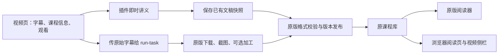

# course2md-web 与上游 course2md 的集成梳理

核查日期：2026-10-02（Asia/Taipei）。下文的差异分析以最初拉取的源码为基线；随后已在本地实现以下集成，使用方式见 [README](../README.md#连接课程库与-cli)。

- 网页文稿显式转换为原版 schema 1，保留画面、元信息、原始字幕时间线及网页章节/原文伴随文档。
- 原课程库发现、连接、别名与逻辑文件夹读取；独立阅读页支持历史版本、摘要目录、搜索、时间跳转、原文/图片开关及段落阅读位置。
- 入库采用原版同类系统文件锁、同卷暂存、完整资产校验与原子版本指针；内容相同的请求可重试，且不会回滚新版本。当前版本损坏时只回退阅读，不改写其指针。
- 可连接原版 2.0 CLI，通过真正的 `run-task` 导出 ZIP/HTML/JSON；不复制原版可移植导出实现、不读取桌面凭据、不伪造桌面队列。
- Windows 和 WSL/Ubuntu 上使用官方 `2.0.0-rc.6` 二进制验证了原版读取、导出、补做摘要、发布锁互斥和新版本读回。CI 添加了固定版本及 SHA-256 的 Linux 原版互操作检查。
- 现有字幕快取、本机 ASR、润色、渐进补图、图片密度、浮窗与视频交互继续使用原流程；新增 UI 沿用现有 kill-ai-slop 纸墨/松绿令牌。完整后台转换队列属于后续独立能力，未替换当前生成方式。
- 本地版本已升为 `0.5.0`，确保旧会话缓存失效，重新生成时采集完整原始字幕；未推送或发布。

**推荐方向：浏览器负责获取当前页面的课程信息、字幕和观看交互；原版负责持久课程库、不可变笔记版本与完整转换。两边交换结构化文稿。**

近期按「文稿兼容 → 原课程库只读接入与浏览器阅读 → 可靠入库 → 原版引擎接管」推进。不要先复制一套桌面任务系统，也不要把“下载了 Markdown”当成“已保存到原课程库”。

## 对比基线与验证范围

| 对象 | 核查版本 | 本地位置 |
| --- | --- | --- |
| Tchirek/course2md-web | `main`，`67e6345bd64b527edbb0f0904a88cb99ee7341c5`；manifest/package 为 `0.4.0` | `F:\shame\course2md-web` |
| mizorewww/course2md | `main`，`83b935347c7a6d7de88b746d11af0e7f095673a8`，`2.0.0-rc.6` | `F:\shame\course2md-upstream` |
| 上游稳定版 | `v1.7.0`，2026-09-06 发布 | 用 `F:\shame\course2md-audit` 中的标签源码核对 |
| kill-ai-slop | 本次拉取的 `main` | `F:\shame\kill-ai-slop-reference` |

上游 `2.0.0-rc.6` 在 2026-09-27 发布，仍为预发布；正式 Latest 是 `1.7.0`。**必须分开处理 1.x 与 2.x 的存储格式。** RC2 已删除旧笔记导入与旧工作区迁移，不能假设原版会自动接受插件的旧导出。

这台机器 PATH 上的 `course2md` 是 `F:\Tools\course2md\course2md.cmd`，实际二进制输出 `course2md 1.3.0`。其包装脚本还把配置、缓存和工具 PATH 指向 `F:\Tools\course2md`；未来探测集成时不能只查 `%APPDATA%`，也不能误把这个旧引擎当成 2.0 引擎。本次未升级原版、安装模型或修改原版配置。

验证结果：

- 使用 `npm ci --ignore-scripts` 安装现有开发依赖，未添加依赖或改动 lockfile。
- `npm run check` 通过：清单检查、严格 JS 类型检查、130 个 Node 测试、9 个共享 ASR Python 测试、49 个浏览器布局断言。
- 实际调用 `buildDoc()` / `toJson()`，确认输出字段与丢失的图片信息，见下文。
- kill-ai-slop 扫描 `src/` 的 59 个文件，得到 5 类、9 个候选命中，已逐项阅读源码核对；同时查看了仓库现有面板截图。
- 未执行真实视频转录、上游 Rust/GPUI 构建或新版桌面端导入。因此“格式可适配”是源码结论，不是已完成的跨应用端到端验证。

来源：[上游发布](https://github.com/mizorewww/course2md/releases)、[RC2 变更](https://github.com/mizorewww/course2md/blob/83b935347c7a6d7de88b746d11af0e7f095673a8/docs/releases/v2.0.0-rc.2.md)。

## 两边现在分别擅长什么

| 能力 | 浏览器插件 | 原版 2.0 RC6 | 配合方式 |
| --- | --- | --- | --- |
| 当前网页字幕 | 利用页面播放器、字幕请求凭证与浏览器登录态 | 通过 yt-dlp 探测/读取字幕，也接受指定字幕 | 保留浏览器优势，直接传字幕事件给原版 |
| 生成文字的速度 | 先显示文字，随后补截图；无需先完成整条管线 | 完整持久任务、阶段进度与最终版本发布 | 保留即时预览，持久处理单独显示状态 |
| 截图 | 按段落时间窗选候选时刻，再去重；密度切换不改变正文分组 | ffmpeg 扫描画面变化，按截图组织正文 | 交换截图与时间线，避免拿同一 density 值声称算法一致 |
| ASR | Qwen3-ASR GGUF + llama.cpp，自定义本机端点；浏览器直读/录音回退 | CoreML、GPU/CPU、NPU、云端 API | 需要完整离线转换时委托原版，页面路径继续独立可用 |
| 润色 | 强度、术语表、只读前文上下文、本机模型或自定义端点 | 视觉辅助、总结、服务管理、请求记录与恢复 | 保存已有润色结果；重新加工时明确选择，避免双重润色 |
| 持久存储 | 手动下载；会话缓存有效期一小时且受扩展版本限制 | 注册课程库、不可变版本、当前版本指针 | 原版课程库作为长期保存位置 |
| 阅读 | 视频旁浮窗/侧栏、时间戳直接 seek 当前播放器 | 独立阅读器、目录、查找、截图、文件、版本、阅读位置与导出 | 原版负责离线管理；浏览器补强观看时联动 |
| 课程管理 | 无持久课程库 | 搜索、逻辑文件夹、列表/卡片、标题别名、多保存位置 | 先只读显示已有库与分类，不建立第二套权威索引 |
| 导出 | 文本 Markdown；图文目录为 `course.md + frames/` | Markdown ZIP、内嵌图片 HTML、结构化 JSON | 将“分享导出”与“原生课程库笔记”分开 |
| 长任务与恢复 | 页面持有编排状态；助手任务在内存中，完成后有时限清理 | 检查点、固定任务参数、暂停/取消、请求状态 | 需要离开标签页后继续的转换交给原版引擎 |

现有兼容价值是真实的：转写事件的 `start/end/text/raw`、段落间隔 3.5 秒、420 字符上限、时间戳与跳转规则，以及 GGUF 模型目录布局已经有意对齐。但这些不等于文稿格式、课程身份、发布过程或运行时完全兼容。

## 课程库入口：真正缺的文件

### 插件现在保存的是什么

调用链是：`Controller.download()` → `imageBundle()` → 后台 `saveBundle()` → `chrome.downloads`。

有图片时得到下载目录里的 `<标题>-<时间后缀>/course.md + frames/slide_*.jpg`；无图片时只有一个 Markdown 文件。它没有 `meta.json`、`document.json`、版本清单或当前版本指针。`toJson()` 虽然存在，当前产品下载入口并没有调用它。

`chrome.downloads` 适合下载到用户下载目录，不能承担任意本地课程库路径下的事务发布。它发起下载后返回也不等于所有文件已经落盘，更不是原版格式校验通过。

源码：[下载入口](F:/shame/course2md-web/src/content/content.js:624)、[图文组装](F:/shame/course2md-web/src/content/exporter.js:48)、[逐文件下载](F:/shame/course2md-web/src/background/sw.js:321)。

### 原版的识别规则

稳定版 1.7 的课程扫描入口寻找 `run.json`，正文阅读 `course.md`。插件连这个扫描入口也未提供；仅有文件名一样不能保证被旧版发现。

2.0 RC6 的 `scan_library()` 递归扫描注册库：

1. 遇到 `current.json` 才按课程读取；隐藏目录和 `versions` 不继续当新课程扫描。
2. `current.json` 指向 `versions/<版本>/manifest.json`。
3. 从 manifest 指向的 `document.json` 读取正文；确认 schema 与非空可读文本。
4. 核对版本身份，校验资源路径、大小和 SHA-256；部分损坏会保留可读内容并显示警告，当前版本坏了可寻找旧的完整版本。

最小的 2.0 原生课程形态是：

```text
<已登记的课程库>/
└── <课程目录>/
    ├── current.json
    └── versions/<version_id>/
        ├── manifest.json
        ├── document.json
        ├── course.md
        ├── meta.json
        ├── frames/                  # 有截图时
        └── timeline.jsonl           # 发布时可保留的细粒度原始时间线
```

`exports/` 是可选分享产物，不决定笔记正文能否阅读。原版不会因为把 Markdown 放进库里就将它变成这种原生版本。

源码：[课程扫描](F:/shame/course2md-upstream/desktop/src/notes.rs:148)、[版本加载](F:/shame/course2md-upstream/desktop/src/notes.rs:75)、[文稿/清单类型](F:/shame/course2md-upstream/src/artifact.rs:95)。

### “能读”与“完整融入桌面”有边界

有效笔记文件可以被注册库扫描并供阅读器展示；**这并不要求有桌面任务记录**。但桌面端的任务历史、失败补做、所选服务/字幕详情及部分离线视频入口，依赖 `desktop-workspace.json` 内的真实任务及对应工作目录。

不能为了出现这些按钮伪造已完成任务，也不能由插件在桌面程序打开时直接改写它的 workspace、服务、阅读位置或逻辑分类文件。桌面程序持有内存状态并自行保存，外部写入会造成状态冲突。

课程库位置应从原版已登记的 `libraries/default_library` 或用户明确指定的位置取得，不等同于 CLI `defaults.out`，也不保证是 `Documents/course2md`。当前桌面首次启动甚至会从配置目录下的 `desktop-local-library` 起步。

源码：[持久工作区字段](F:/shame/course2md-upstream/desktop/src/workspace.rs:449)、[任务关联动作](F:/shame/course2md-upstream/desktop/src/reader_ui.rs:3447)、[离线视频条件](F:/shame/course2md-upstream/desktop/src/reader_ui.rs:87)。

## JSON 需要真正对齐，不能只改字段名

本次实际调用插件 `buildDoc()`，输入了一章、一段文字、一张 `frames/slide_0001.jpg`。输出包含 `schemaVersion: 1`、`generator.version: "0.1.0"`、`meta.url/site`、`sections[].segments`；**输入的 frames 没有进入输出**。

对比原版原生正文：

| 内容 | 插件 `Doc` | 原版 `artifact::Document` | 必要处理 |
| --- | --- | --- | --- |
| 版本字段 | `schemaVersion` | `schema` | 分别识别格式；不能因数字同为 1 就混用 |
| 生成器 | 有，版本硬编码 `0.1.0` | 原生 Document 没有这个字段 | 修正插件溯源版本；额外信息单独保留 |
| 来源链接 | `meta.url` | `meta.webpage_url` | 明确映射、校验 URL |
| 平台 | `meta.site` | `meta.extractor` | 使用真实平台，不把文字来源 subtitle/asr 当平台 |
| 视频身份 | 导出 Doc 未保留 `videoId/cid` | `meta.id`、manifest `source_id/course_id` | 保留 adapter 身份，按上游规则派生 |
| 正文 | `sections[].segments` | `sections[].speech` | 映射事件，并保留 `raw` |
| 图片结构 | 面板章节里有多张 `frames[]`；buildDoc 不保留 | 一个 Section 只有一个 `image` | 按截图时间构建 Sections，文本不重复、不截断词 |
| 章节标题 | Section `title` | Section 无章节标题字段 | 额外保存章节；原版当前阅读器不会自动显示这些标题 |
| 摘要 | 当前 Doc 无上游摘要结构 | `summary: {tldr,key_points,outline}` 或 null | 未生成就为 null，不拿平台章节假装 AI 摘要 |
| 原文与跳过内容 | 分段保留部分 raw；buildDoc 过滤 skipped | `raw` + 可保留原始 timeline | 展示结果与原始语料分开，不把隐藏误当永久删除 |

尤其要分清三种 JSON：插件内部 Doc、原版 `document.json`、原版 portable `structured.json`。它们不是同一格式。RC6 的 portable JSON 使用 `image_id` 与图片摘要列表，并不内嵌图片字节；不能靠这一 JSON 单文件恢复图文课程库。

建议保留插件现有展示模型，仅在交换边界加一处显式转换。不要为了兼容而重写整条 UI/pipeline，也不要从 Markdown 反解析重建原始时间线。

转换必须解决：无图纯文字、章节多图、首图前的语音、跨截图长段、缺图、无效/未知时长、raw 留存、skipped 原文留存。两边的分组是不同语义，不能机械复制数组。

源码：[插件 Doc](F:/shame/course2md-web/src/core/format.js:86)、[按时刻附图](F:/shame/course2md-web/src/content/visual.js:12)、[原版 Section](F:/shame/course2md-upstream/src/timeline.rs:31)、[portable JSON](F:/shame/course2md-upstream/src/portable.rs:176)。

## 原课程库与阅读器可以怎样接入

### 最早可交付：原课程库只读接入

复用已安装的本机助手，由它读取已连接库中的 `current.json/manifest.json/document.json`，返回精简目录与正文。后台保留访问令牌，内容脚本只得到所需数据。

可以提供：

- 查看原版已生成课程，按标题与作者搜索。
- 读取原版的逻辑文件夹与标题别名进行展示。
- 打开当前或历史版本，呈现截图、原文、润色结果与摘要。
- 在当前视频页找到同来源的已有笔记，直接打开，减少重复生成。
- 修改库位置或外接盘离线时，显示可恢复的连接状态，不创建空库掩盖问题。

首版用「刷新」足够。没有发现上游对外暴露的课程库 HTTP API、自动文件监听契约或可直接打开指定笔记的 deep link；不能先承诺“保存后立刻唤醒桌面并跳到该课”。

无需为目录再建 SQLite、云同步或第二套分类数据库。课程库仍由原版管理，插件只读与缓存目录。

### 浏览器阅读器：复用数据，补观看联动

原版阅读器是 Rust/GPUI 原生界面，不是一个可以嵌入扩展的网页组件。可以复用它的数据格式和阅读规则，不能直接把 UI 代码拿来运行。

浏览器端建议先扩展现有文章呈现能力：独立扩展页面提供完整阅读，当前视频旁保留轻量侧栏。同一份原生文稿经过适配后交给现有正文渲染；复制和导出也复用现有函数。

首版所需能力：目录、正文查找、截图查看、原文/润色切换、时间戳回到原视频；其次再补版本选择和阅读位置。阅读位置先保存在扩展自己名下，按课程/版本/视图区分，并以时间戳或稳定段落定位，不能跨 UI 共享像素 offset，更不能直接写桌面 workspace。

当前页播放同步属于浏览器的优势。点击文稿时间戳可以 seek 现有播放器；打开另一个视频则先导航并在来源身份确认后应用跳转，避免旧标签页或错误分 P 被操作。

长篇正文与图片先使用分页/增量呈现、图片按需加载。只有性能测量表明仍有问题时再引入复杂虚拟化；原版有虚拟化不意味着插件必须复制 GPUI 的实现。

## 保存当前讲义与委托原版转换是两个动作



图中的“文稿快照导入”是建议新增能力；**现有 `run-task` 不是文稿导入器**。

### 保存当前讲义快照

目标是已有文字和截图直接成为一个新笔记版本，保存期间不重新下载媒体、转录或润色。

长期最佳边界是一个小的原版导入/发布命令：接收文稿及本地暂存资源，调用现有 `artifact::publish`，继承原版版本锁、哈希、同盘暂存、原子重命名和 current 指针提交。该命令目前不存在，需要上游配合或另行准备明确版本的集成工具。

不需要改上游也可以实现格式兼容的离线文稿包；但自动写入原库与同课程并发发布，远比“生成几份 JSON”复杂。原版 `.publish.lock` 是 OS 文件锁，Node 的 `wx` 锁文件与它不是同一把锁。若采用独立写入器，必须先验证跨进程锁和所有平台的原子提交语义；否则只导出待导入包，不发布到共享课程目录。

快照应包含当前展示结果与原文，明确截图和润色各自的实际结果；未要求总结就是 `not_requested`，不是 `succeeded`。生成中的内容先放暂存，只有发布成功才能显示“已保存到课程库”。同次保存重试应返回同一发布结果；正文或显示结果真的改变才创建新版本。

源码：[发布过程](F:/shame/course2md-upstream/src/artifact.rs:329)、[OS 锁](F:/shame/course2md-upstream/src/runtime.rs:263)。

### 已可利用：`run-task` 接受浏览器字幕

原版 `execution::Request` 有 `subtitle_events`，接受 `start/end/text/raw` 事件；从 stdin 读取 JSON，正文任务参数上限 16 MiB。引擎已输出 NDJSON 的阶段、进度、完成和错误，并支持工作目录内的 control 文件。

可以复用现有助手启动匹配版本的 `course2md run-task`：浏览器读取原始字幕 → 助手构造固定 Request → stdin 发送 → 按 NDJSON 显示进度 → 引擎发布有效版本 → 刷新课程库。

真实限制：

- 已选字幕可以省掉重复抓取与 ASR，但 `run_prepared()` 仍检查 ffmpeg/ffprobe/yt-dlp、取得完整视频并执行截图。它不是秒级保存入口，也没有原生“只存当前图文”的 operation。
- 插件当前 `PipelineResult` 主要保留合并后的段落，没有把所有原始字幕事件作为独立产物返回。要复用原始输入，应在合并/繁简转换/润色前保存语料，不把润色后的段落冒充原字幕重新处理。
- 原版失败的截图可产生有正文的 partial 笔记；用户界面应如实区分部分成功与完全成功。
- 从助手运行外部引擎得到的笔记可进入课程库，但不会自动成为桌面 GUI 的已入队任务；任务管理的完全互通还需要原版受控入口。
- 双方登录态不同。浏览器当前能给自己的 yt-dlp 传短期 cookie 文件；原版引擎有自己的登录体系，不能假设自动继承浏览器的 cookie。受限视频需要明确的临时凭据或已缓存本地媒体交接方案，并在结束后清理。
- 若已经在浏览器润色，快照保存沿用已有 text/raw；委托原版重新加工必须明确选择，防止再次润色或再次收费。

这里无需新建 HTTP 守护进程：插件已经有 `127.0.0.1:8766` 助手、Native Messaging 唤醒和任务轮询。扩展其受保护能力即可。

源码：[任务契约](F:/shame/course2md-upstream/src/execution.rs:29)、[接受字幕事件](F:/shame/course2md-upstream/src/pipeline.rs:184)、[完整媒体/截图阶段](F:/shame/course2md-upstream/src/pipeline.rs:687)、[现有助手路由](F:/shame/course2md-web/tools/fast-asr-server.mjs:85)。

## 身份、文件与服务的细节

### 课程去重必须使用来源身份

上游在线身份是 `online:<extractor>:<id字节数>:<id>`；课程 ID/目录名由该身份的 SHA-256 前 32 位派生为 `course-…`。B 站保留分 P / 交互段身份，普通分 P 常为 `BV…_pN`。本地文件使用内容身份，而不是文件名。

插件 URL 会保留 B 站 `p`，但最终 Doc 丢掉 adapter 的 videoId/cid。要先保留足够来源信息，再尽可能使用原版探测结果确定身份，不能仅按标题、BV 号或去掉查询参数的 URL 去重。一般视频页与本地文件没有可信平台 ID 时，不要猜出一个会与别的课冲突的身份。

章节、字幕语言、字幕来源、模型与版本信息属于溯源，不应混入课程身份让同一视频无限裂成新课程；它们应区分笔记版本和处理计划。

源码：[在线身份](F:/shame/course2md-upstream/src/fetch.rs:175)、[分 P 候选身份](F:/shame/course2md-upstream/src/fetch.rs:364)、[课程目录](F:/shame/course2md-upstream/desktop/src/workspace.rs:36)。

### 文件访问通过现有助手，不把磁盘路径交给网页

保留当前的 localhost 限制、Native Messaging 扩展白名单、访问令牌与后台代理。新增库读写能力需校验注册/选定根目录、课程/版本 ID、相对资源路径、实际 canonical 路径与普通文件类型，拒绝路径穿越和 symlink 逃逸。导入图片还应限制格式、单张/总字节数和数量，并校验实际内容。

现有助手 `MAX_BODY` 只有 128 KiB，不能直接塞一小时全文加 base64 图片。引擎 Request 的 16 MiB 上限也不适合承载图片字节。利用助手已经取得的截图资源暂存文件或逐个资源上传，正文与资源分开交接；不要一开始加通用流协议。

已发布版本不可原地改写，磁盘满、程序崩溃或导入失败不能让 `current.json` 指向半成品。路径、原文和当前完整版本必须保留，失败可重试。

### 模型文件共用已实现，进程与配置仍需界定

插件已有读取原版 `config.toml` 的模型路径、同名 GGUF 两文件和固定 SHA-256 校验，卸载也不删除共享模型。这部分无需重做。

但插件固定模型 revision/哈希；原版当前从 Hugging Face `resolve/main` 下载同名文件。未来内容更新时，“同一文件名”仍可能校验不符。继续保持不覆盖、不静默重下，先报告兼容情况。

共用 GGUF 不等于共用 llama-server 进程、GPU 内存、运行库或 ASR 后端。原版可能选 CoreML/NPU，插件仍可能另起 GGUF 服务。完整引擎委托能减少后端逻辑分叉，但应先释放插件空闲模型或明确协调资源，不把两套模型同时塞进有限显存。

2.0 桌面服务配置也有独立 preferences、版本与 CredentialVault。不能仅同步 `config.toml` 就声称继承桌面所有 AI 服务，更不能把原版凭据读出来返回 content script。首版连接设置只需要库位置、引擎位置和能力状态。

## UI：保持现有样式，只补真实入口

按照用户确认，后续 UI 严格遵循 [kill-ai-slop](https://github.com/yetone/kill-ai-slop)；重点是减法、信息层级与真实功能，不复制它的网站外观。

建议的最小变化：

- 扩展入口增加“课程库”，打开独立列表页；搜索框、课程标题、作者/时长、保存日期与必要状态即可。
- 面板动作区增加“保存到课程库”，保留复制与普通下载。需要节约宽度时，把次要导出收进现有菜单。
- 已有课程命中时显示一行“已有笔记 · 打开”，不再默认重复转录。
- 设置页新增一组“course2md CLI”：库位置、引擎位置、连接/检测结果。先选只读库也能阅读，不强迫用户先安装 ASR。
- “打开桌面阅读器”只有在确实能导航到该版本时出现。暂时只能启动应用时，应明确命名为“打开 course2md”，不能暗示笔记已定位。
- 课程正文继续系统字体、现有松绿强调色、细线与留白。独立阅读页按长文需要增大正文和行宽，不强行沿用紧凑浮窗的字号。

不用营销首页、统计仪表盘、渐变卡片、装饰编号、徽章墙或额外主题系统。错误与成功主要用动作附近的文字说明；阅读、连接和保存状态彼此独立。

本次扫描命中核对：

| 扫描类别 | 位置 | 人工结论 |
| --- | --- | --- |
| 06 氛围渐变 | `src/ui/panel.css:323` | 是与实际比例绑定的进度环，不是背景装饰，保留 |
| 15 emoji | `content.js:75/478`、`title-launcher.js:1` | 是注释中的入口箭头；产品入口有实际功能，不是装饰 emoji 墙 |
| 19 大圆角/玻璃 | `panel.css:130/323`、`tokens.css:518` | 分隔点、进度环、加载小点的圆形几何，不是卡片或输入框的胶囊化 |
| 26 弹跳动画 | `tokens.css:490` | 实际进度条宽度更新；未发现 hover 放大或弹跳 |
| 34 终端风 | `tokens.css:44` | 代码字体变量，未发现非代码界面泛用等宽字体 |

源码和已有截图没有提供必须立即改 UI 的依据。新增图标优先复用已存在且语义合适的图标；需要扩充时采用有出处的规范图标，不能靠注释自称“非 AI 图标”代替视觉质量检查。扫描不能证明无误，新增页面仍须看真实渲染和键盘行为。

## 建议拆成可验收的小步

| 优先级 | 工作 | 能交付的结果 | 上游改动依赖 |
| --- | --- | --- | --- |
| P0 | 固定版本的文稿转换、身份与溯源契约 | 不再只声称字段对齐；有可验证的上游正文样本，保留原文/图片/来源 | 不需要 |
| P1 | 现有助手只读连接原库，独立浏览器阅读页 | 能读原版生成的课；同来源识别已有笔记，回到视频 | 不需要 |
| P1 | 原生快照导入与安全发布 | 浏览器已有结果真正进库；新版本不覆盖旧版本 | 最好由上游增加小型导入/发布入口 |
| P2 | 助手桥接 `run-task` 与选定原始字幕 | 原版处理完整转换，复用它的发布、ASR 与进度 | 现有引擎可用；GUI 队列互通另需入口 |
| P2 | 指定课程/版本的原版打开入口 | 保存后确实能定位桌面阅读器 | 需要上游提供受控命令或 deep link |
| 后续 | 双向阅读位置、分类编辑、队列完全互通 | 跨界面管理体验一致 | 需要明确的单一写入方与受控 API |

首轮实现建议范围：**只改交换格式边界、现有助手的受保护读取路由、后台代理和一个课程库/阅读页面。** 不把 service worker 变成持久队列，不新增框架或数据库，不接入云端。

格式边界可以新增一份专用适配模块和一份小的 fixture 检查；不要把 Rust 业务流程逐行翻译成 JS。图片/段落归属是实质逻辑，需真实样本验证，不只测字段改名。

如果希望先见到“直接进原库”，先做最小导入发布入口的可行性验证，再扩展课程库 UI；不要用兼容性不明的 writer 绕过事务边界。

### 必须验证的样本与失败条件

| 场景 | 验收标准 |
| --- | --- |
| 纯文字、有图、章节多图 | 原文不丢、不重复；时间顺序、图片归属和路径正确 |
| 字幕 + 润色、部分润色失败、隐藏片段 | text/raw 与结果状态真实；重新导入不重复润色 |
| YouTube 长课、B 站 P1/P2、同名视频 | 身份稳定；分 P 不合并；标题修改不另建课程 |
| 同一份笔记连续保存/超时重试 | 同次操作幂等；新内容生成新版本，旧版保留 |
| 原版与插件同时生成同一课程 | 同一 OS 发布锁；current 不回退、不指向未完成版本 |
| 缺图、坏哈希、未知 schema、越界路径 | 错误可解释；拒绝危险输入；完整旧版本可继续阅读 |
| 磁盘满、发布中断、外接盘掉线 | 不显示假成功；不改坏原文件；恢复后可重试 |
| 浏览器/扩展重启、SW 回收 | 已保存讲义仍存在；进行中行为与恢复范围明确 |
| 原版生成 → 浏览器阅读 → 回到原视频 | 来源身份核对；时间戳跳转正确；搜索与截图可用 |
| Windows/macOS/Linux | 路径、配置探测、锁、原子提交、localhost 权限分别验证 |

上游阅读验证需调用真实读取/校验实现，不能只用 JS 自己验证自己写出的 JSON；至少将 fixture 放进隔离课程库，用 `artifact::validate_version`、`scan_library` 和 `read_preview` 验证，最后在匹配版本的 GUI 打开。现有本地 1.3.0 不适合当这一步的验收引擎。

## 上游协作可控制得很小

最值得与上游讨论的是三处扩展边界：

1. **导入已有文稿并发布笔记版本**：复用 artifact 发布器，不重写下载、ASR 或 reader。
2. **打开指定已登记库中的课程/版本**：提供受控入口，路径/身份校验由原版负责。
3. **机器可读的能力与格式版本说明**：让助手区分 stable 1.x、2.0 与未知版本，遇到不支持的格式停止自动写入。

章节标题和外部生成器溯源是后续小项：目前可以额外保存但原版 UI 不展示，若确实需要跨端显示，再提出兼容的字段支持。

查询当前仓库 issue/PR 历史未发现这几项已有公开实现。历史 [PR #10](https://github.com/mizorewww/course2md/pull/10) 曾提交整套本地 Web 服务，已关闭未合并；维护者的公开评论包含“这个有点过于GPT风味了”。这说明不能拿该 PR 的 server 当现有能力，也不足以推断维护者拒绝所有浏览器集成。建议先拿一个具体文稿样本与最小导入需求沟通，避免把 UI、队列、服务和无关修复揉进一次提案。

本次只完成本地拉取、阅读、检查与本文档，未创建分支、提交、push、issue 或 PR。后续上游贡献应重新核查实时规则与重叠工作。插件 `main` 的每次 push 都会触发自动发布，也应在实际发布前确认变更范围。

**建议先落地 P0 和只读 P1，同时验证快照导入入口；它们最直接服务“浏览器生成/观看，原版收藏/阅读”这一条完整使用路径。**
